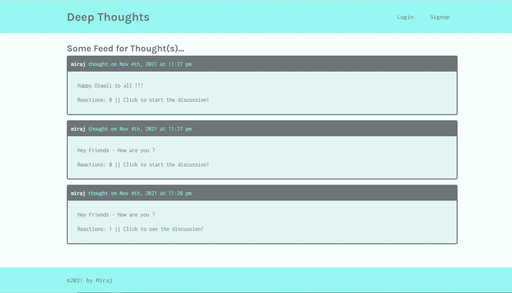
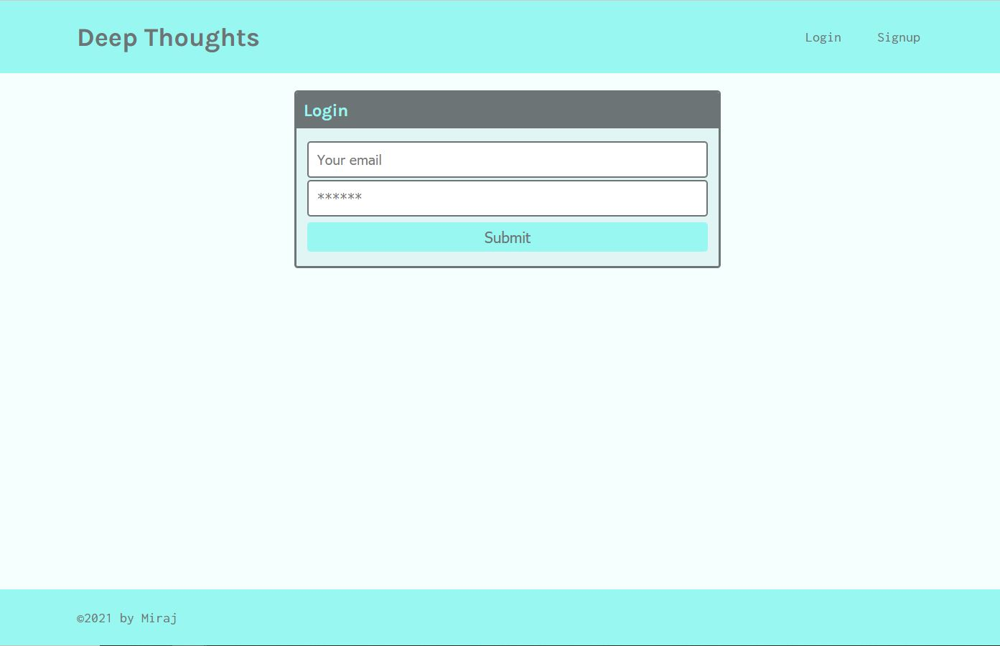
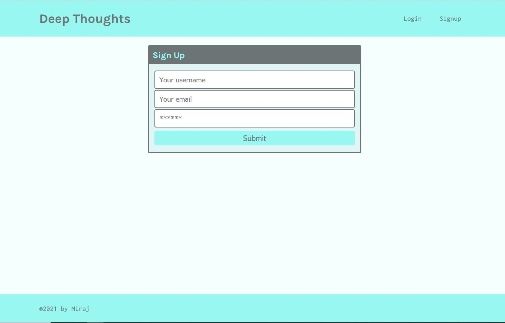
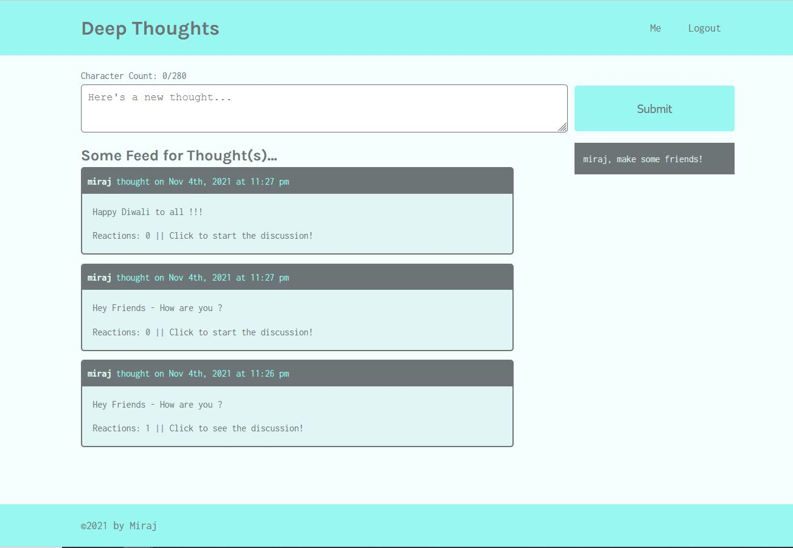
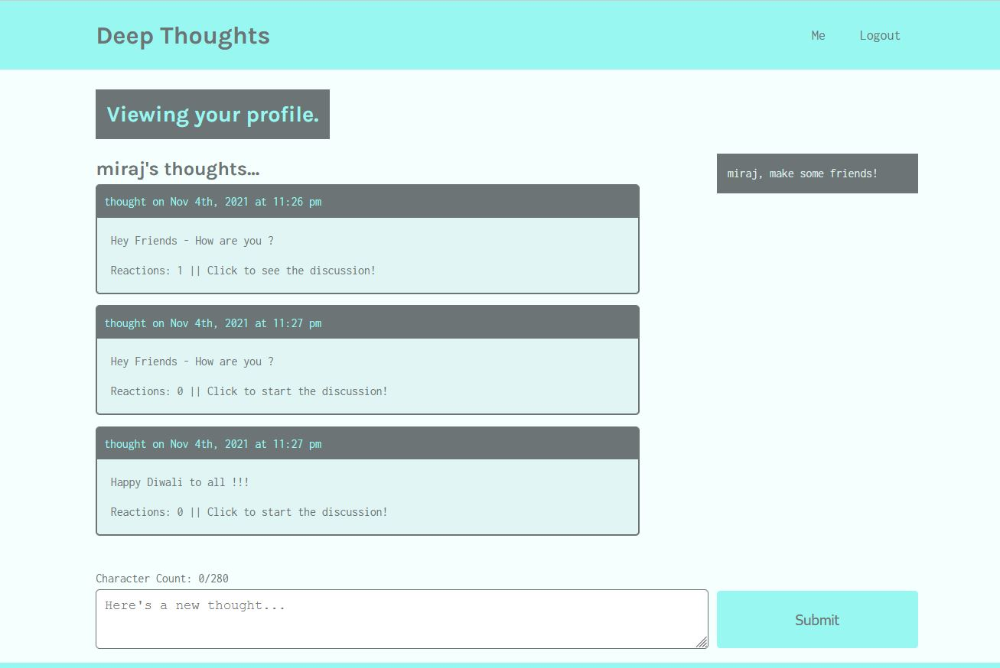
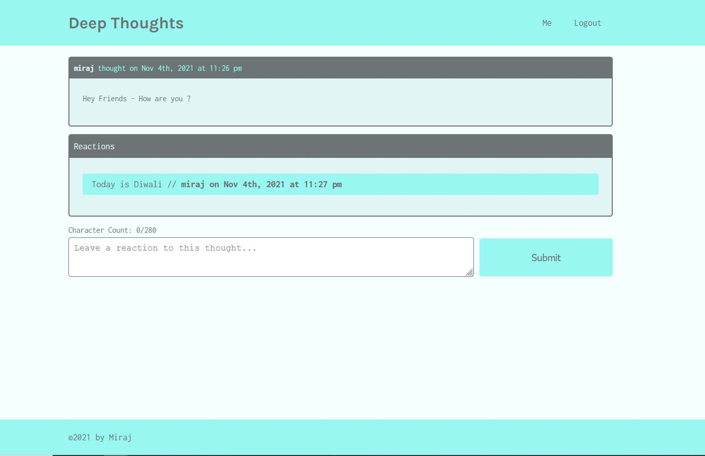

# deep-thoughts

## Description :
deep-thoughts is a MERN ( MongoDB, Express.js, React.js, Node.js) based Full Stack application. 
This application is using components and JSX in React for Front End client side while Node, Express and MongoDB database on server side. 

* The requirement from the client was as below:
```
As a user, I can retrieve data about users, their thoughts, reactions, and friends from the server

As a user, I can create my own account and login

As a logged in user, I can create thoughts, react to thoughts, and add friends

As a user, I can see every user's thoughts listed on the homepage of the application

As a user, I can navigate directly to a user's profile page with their thoughts and friends list

As a user, I can navigate directly to a single thought's page to view reactions to that thought

As a user, I can create an account and login to the application through the front end

As a user, I can create a thought, create a reaction to a thought, and add a friend through the front end of the application
```

## Languages and other components used : 
```
   * npm (node package manager) 
   * React
   * React-router
   * Node.js
   * Express.js
   * MongoDB database
   * apollo-server
   * apollo-client
   * graphQL
   * MongoDb Atlas
   * Heroku App
   * github
```

## How to install : 

 To install the application in your computer follow the steps below: 

   Clone the repository in your computer :
    - open the command line and go to the directory where you want to clone the repository.
    - then clone the repo by typing : " git clone git@github.com:miraj00/deep-thoughts.git "

Here is a list of commands that were used while building this project :
```
- npm install
- npm run seed
- npm install mongoose
- npm install bcrypt --save
- mongod ( to start mongoDB server in initial phase )
- npm i apollo-server-express graphql
- npm run watch ( to run apollo server )
- npm install jsonwebtoken
- npx create-react-app client ( to setup react )
- npm start ( to start client server initially )
- npm i @apollo/cleint graphql
- npm install -D concurrently
- npm install react-router-dom
- npm install jwt-decode
- heroku create
- git push heroku main
- git add .
- git commit -m ________
- git push origin main
```

### How to Use the application : 

Once cloned locally and dependencies are installed, Run " npm run develop " command in command prompt to start both servers with a single command ( It should automatically open the browser and direct to http://localhost:3000/ ).  

## Below is the screenshot and Deployed application of the Project as per client request ## 








### Deployed Sites ##

[Please click here to see deployed code on Github](https://github.com/miraj00/deep-thoughts)

[Please click here to see deployed application on Heroku App](https://safe-mountain-58316.herokuapp.com/)